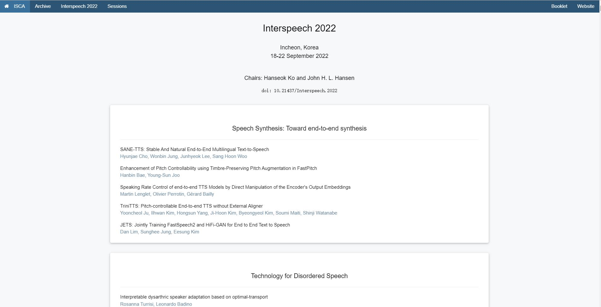

# `Interspeech 2022` 论文爬虫

## <a href="https://www.isca-speech.org/archive/interspeech_2022/">`Interspeech 2022`</a>


## 代码运行
- 创建虚拟环境
```shell
python3 -m venv env
```

- 激活虚拟环境
```shell
source env/bin/activate
```

- 安装依赖
```shell
pip install -r requirements.txt
```

- 运行代码
```shell
python main.py
```

- 所有的论文都以PDF的形式下载在pdf文件夹下